## Agenda

- Da ideia ao produto no ar
- Quem faz o quê
- Trabalhando em ciclos rápidos
- Comprar ou construir a própria solução
- Como medir o sucesso de um produto
- Inteligência artificial no software
- Fechando com um caso prático

::: notes
Abertura: o objetivo desta conversa é desmistificar como um produto ou uma
funcionalidade nasce, quem participa e como a inteligência artificial está
mudando o que conseguimos entregar. Linguagem de negócio, sem jargão técnico.
:::

# Da ideia ao produto no ar

## O que chamamos de "produto" e de "funcionalidade"

- Produto: a solução completa que entrega valor ao cliente (um aplicativo, um sistema, um serviço digital)
- Funcionalidade: uma capacidade específica dentro desse produto (por exemplo, "consultar uma apólice" ou "simular um seguro")
- Todo produto é feito de várias funcionalidades, construídas e entregues aos poucos
- Cada uma delas passa por um ciclo parecido, do problema até o uso real pelo cliente

## O ciclo de vida, do início ao fim

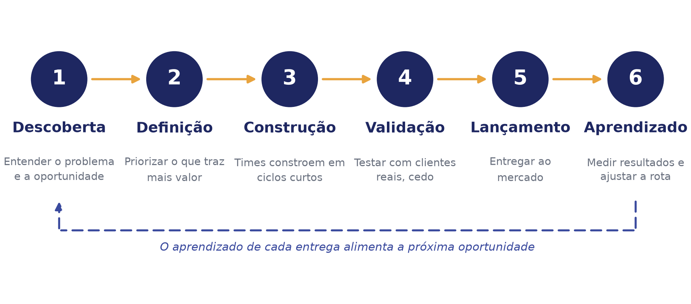{width=92%}

::: notes
Este é o mapa mental de toda a apresentação. Toda funcionalidade, por menor
que seja, passa por essas seis etapas, e o aprendizado de uma rodada alimenta
a próxima oportunidade.
:::

## Como nasce uma nova funcionalidade

- Alguém identifica uma oportunidade: um problema do cliente, um pedido do mercado ou um número que chama atenção
- Essa oportunidade vira uma hipótese: "se resolvermos isso, geramos este resultado"
- As hipóteses são priorizadas: nem tudo pode ser feito ao mesmo tempo, então escolhemos o que traz mais valor primeiro
- Só depois disso o time começa a desenhar a solução

## Da definição ao lançamento

- A solução é desenhada em conjunto, com entradas de negócio e de tecnologia
- A construção acontece em pedaços pequenos, não em um único bloco gigante
- Cada pedaço é testado com usuários reais antes de seguir adiante
- O lançamento costuma ser gradual: primeiro para poucos clientes, depois para todos
- Depois de lançado, os resultados são acompanhados de perto para decidir os próximos passos

# Quem faz o quê

## Três papéis, um objetivo em comum

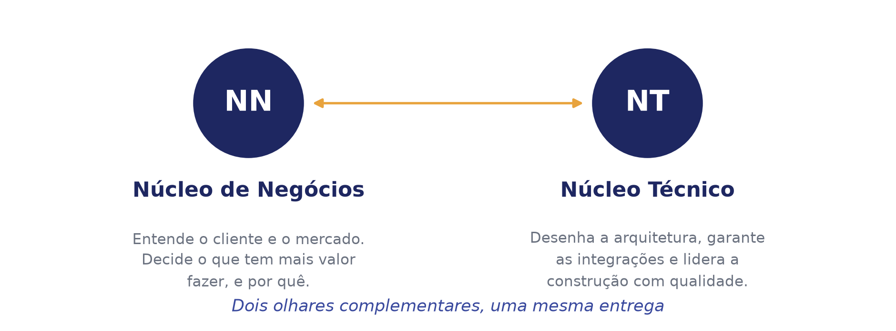{width=92%}

## Product Owner: a voz do negócio e do cliente

- Entende profundamente o cliente, o mercado e a estratégia do negócio
- Decide o que deve ser feito primeiro, com base no valor gerado
- É o ponto de contato entre as áreas de negócio e o time que constrói a solução
- Garante que o time esteja sempre resolvendo o problema certo

## System Engineer: a costura entre os sistemas

- Olha para o produto de forma ampla, além de uma única funcionalidade
- Garante que as diferentes partes do sistema conversem entre si sem atrito
- Cuida da integração com sistemas de parceiros e de outras áreas da empresa
- Pensa em crescimento futuro: a solução precisa continuar funcionando bem quando o uso aumentar

## Tech Lead: qualidade e liderança técnica

- Lidera o time responsável por construir a solução no dia a dia
- Decide, junto com o time, a melhor forma técnica de resolver cada problema
- Cuida da qualidade, da segurança e da manutenção do que é construído
- Ajuda a estimar prazos e a identificar riscos antes que eles virem problemas

# Trabalhando em ciclos rápidos

## O que são metodologias ágeis, em termos simples

- São formas de organizar o trabalho em ciclos curtos, em vez de um grande projeto fechado
- A cada ciclo, o time entrega algo que pode ser mostrado e avaliado
- O plano se ajusta com frequência, a partir do que se aprende com clientes reais
- O objetivo é reduzir o risco de investir muito tempo em algo que o mercado não quer

## Pequenas entregas, feedback constante

- O trabalho é dividido em ciclos de poucas semanas
- Ao final de cada ciclo, o time mostra o que foi construído e recebe feedback
- Problemas são identificados cedo, quando ainda são baratos e fáceis de corrigir
- A equipe de negócio acompanha o progresso de perto, sem surpresas no final

## Ciclo de validação rápida

- Antes de construir a solução completa, testamos uma versão simples da ideia
- Essa versão é colocada na frente de clientes reais o quanto antes
- Os resultados reais substituem suposições: aprendemos o que funciona de verdade
- Só investimos pesado depois de validar que a ideia gera o resultado esperado

## Por que isso importa para o negócio

- Reduz o risco de gastar tempo e dinheiro em algo que ninguém vai usar
- Acelera o tempo entre a ideia e o valor entregue ao cliente
- Dá visibilidade constante ao negócio sobre o andamento do trabalho
- Permite mudar de direção rapidamente quando o mercado muda

# Comprar ou construir a própria solução

## Duas formas de resolver o mesmo problema

{width=90%}

::: notes
Antes de decidir construir algo internamente, toda empresa enfrenta essa
escolha: pagar por uma solução que já existe no mercado ou investir tempo e
time próprio para construir algo sob medida. Não existe resposta certa
única; depende do quanto aquilo diferencia o negócio.
:::

## Quando compensa comprar uma solução pronta

- O problema já foi resolvido por outras empresas de forma madura e testada
- A velocidade de implantação importa mais do que a personalização
- O time interno pode focar energia no que realmente diferencia o negócio
- O custo inicial é mais previsível e geralmente mais baixo

## Quando compensa construir a própria solução

- A necessidade é muito específica do negócio, e não existe solução pronta parecida
- Essa capacidade é uma vantagem competitiva que vale a pena proteger
- Há dependência de integração profunda com outros sistemas internos
- No longo prazo, construir pode custar menos do que pagar por uso crescente

## O crescimento das assinaturas (SaaS)

- Cada vez mais empresas oferecem software como um serviço por assinatura, em vez de vender uma licença única
- O cliente paga um valor recorrente, geralmente mensal ou anual, para continuar usando
- Isso reduz o investimento inicial de quem compra, e cria uma receita previsível para quem vende
- O sucesso desse modelo depende de uma coisa acima de tudo: o cliente continuar renovando

## O coração do modelo: a renovação

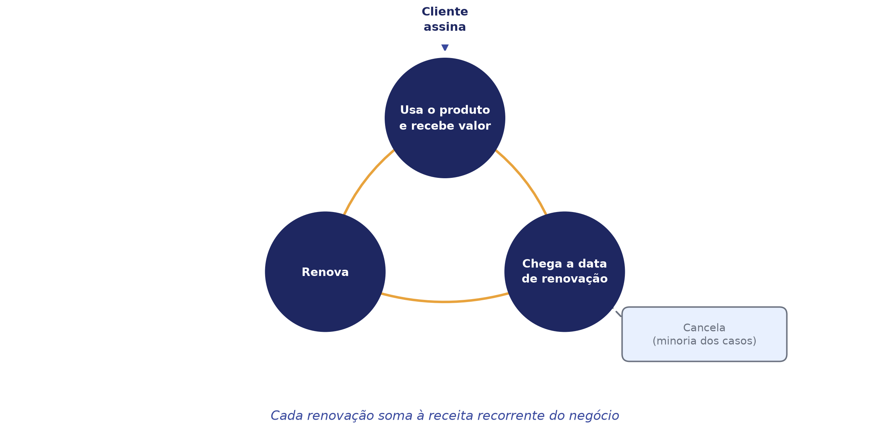{width=88%}

::: notes
Diferente de uma venda única, no modelo de assinatura a venda nunca termina
de verdade. A cada ciclo, o cliente decide se continua ou não, e é essa
decisão repetida que sustenta o negócio.
:::

## Por que o fluxo de caixa muda tanto

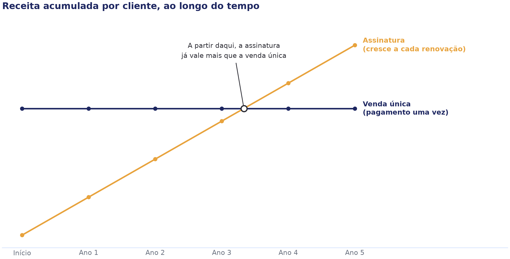{width=92%}

::: notes
Uma venda tradicional traz um caixa grande de uma vez só, mas que não se
repete. Uma assinatura traz valores menores no começo, porém, se a
renovação for saudável, a receita se acumula e ultrapassa a venda única com
o tempo. Por isso empresas de assinatura acompanham de perto a taxa de
renovação: é o que garante caixa no futuro.
:::

## O que isso significa para quem decide

- Comprar ou construir depende do quanto aquela solução diferencia o negócio, não só do preço
- Um contrato de assinatura troca um gasto grande e único por um compromisso contínuo
- A saúde financeira de um negócio de assinatura se mede pela renovação, não só pela venda inicial
- Cancelamentos custam caro: cada cliente perdido reduz a receita futura já esperada

# Como medir o sucesso de um produto

## Por que medir importa

- Lançar um produto ou uma funcionalidade não é o fim da história, é o começo de uma nova etapa
- Sem números, decisões viram opinião: "eu acho que está indo bem" não é o mesmo que saber
- Métricas bem escolhidas mostram se o problema do cliente foi realmente resolvido
- É esse acompanhamento que fecha o ciclo de aprendizado visto no início desta conversa

## Três grupos de métricas para acompanhar

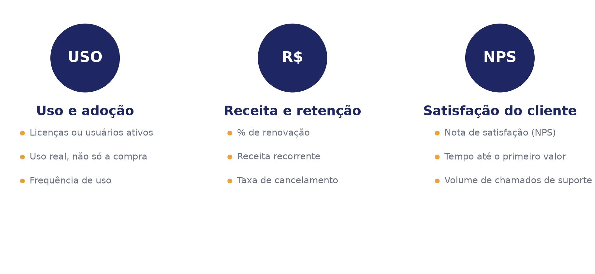{width=95%}

::: notes
Uso e adoção mostram se o produto está sendo aproveitado de verdade. Receita
e retenção mostram a saúde financeira do negócio. Satisfação mostra se o
cliente recomendaria o produto a outra pessoa. Os três juntos dão uma visão
completa; olhar só para um deles esconde parte do quadro.
:::

## Licenças ativas: quantidade não é tudo

- Contar licenças ou usuários ativos é o primeiro passo, mas não o único
- Uma licença comprada e nunca usada é um sinal de alerta, não de sucesso
- O que importa é a proporção de usuários que voltam a usar o produto com frequência
- Esse número ajuda a antecipar cancelamentos antes que eles aconteçam

## A porcentagem de renovação: o termômetro do negócio

- Mede quantos clientes decidem continuar, quando chega a hora de renovar
- Uma renovação alta confirma que o produto entrega valor de forma consistente
- Uma renovação baixa é um alerta antecipado, mesmo que a venda inicial tenha sido um sucesso
- É a métrica mais próxima de uma resposta direta à pergunta: "o cliente pagaria por isso de novo?"

## Cuidado com métricas de vaidade

{width=92%}

::: notes
É tentador comemorar números grandes e visíveis, como total de downloads ou
visitas. Mas esses números podem crescer mesmo que o produto não esteja
gerando valor real. O time de negócio deve sempre perguntar: essa métrica
prova que o cliente está satisfeito e vai continuar pagando?
:::

## Transformando números em decisão

- Escolher poucas métricas, bem definidas, vale mais do que acompanhar dezenas de números soltos
- Cada métrica deve ter um responsável e um motivo claro para existir
- Uma métrica só é útil se ela muda alguma decisão quando o número se move
- Revisar essas métricas com frequência é parte do trabalho, não uma tarefa extra

# Inteligência artificial no software

## IA como uma nova camada dos produtos digitais

- Até pouco tempo atrás, sistemas seguiam apenas regras fixas, escritas por pessoas
- Hoje, a inteligência artificial permite que sistemas entendam linguagem natural e respondam de forma mais flexível
- Isso abre espaço para assistentes que conversam com o cliente, resumem informações e ajudam pessoas a decidir mais rápido
- O desafio deixou de ser "o sistema entende o pedido?" e passou a ser "a resposta é confiável?"

## Duas formas de a IA consultar informação

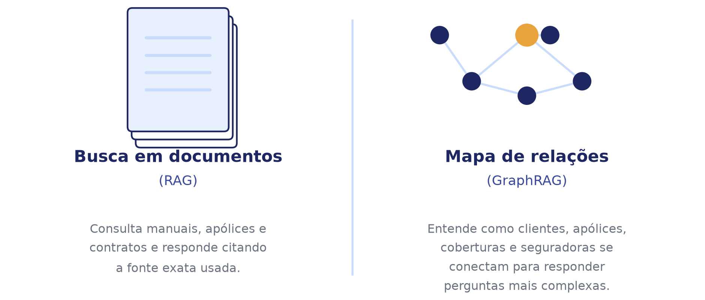{width=95%}

::: notes
RAG: o assistente busca em documentos relevantes antes de responder, como um
bom atendente que consulta o manual certo. GraphRAG vai além: entende como as
informações se conectam entre si, como um mapa de relacionamentos, o que
ajuda a responder perguntas mais complexas.
:::

# Mensagens-chave

## O que vale levar desta conversa

- Todo produto e toda funcionalidade seguem um ciclo, da oportunidade ao aprendizado
- Product Owner, System Engineer e Tech Lead olham para o mesmo problema sob ângulos diferentes
- Ciclos curtos e validação rápida reduzem risco e aceleram resultados
- Comprar ou construir depende do quanto a solução diferencia o negócio, e um modelo por assinatura vive da renovação
- Métricas de uso, receita e satisfação mostram se um produto está realmente funcionando
- A inteligência artificial adiciona uma nova camada de valor, mas exige dados confiáveis e boa governança

# Um caso prático: juntando tudo o que vimos

## O contexto: NovaSeguro Corretora (exemplo fictício)

- A NovaSeguro trabalha com várias seguradoras parceiras ao mesmo tempo
- Cada seguradora tem suas próprias regras, apólices, coberturas e prazos
- Os corretores precisam responder perguntas de clientes com rapidez e precisão
- Hoje, essa informação está espalhada entre manuais, planilhas e sistemas diferentes

## O desafio do dia a dia

- Encontrar a informação certa toma tempo e depende de quem está de plantão
- É difícil comparar coberturas entre seguradoras diferentes na hora da conversa com o cliente
- Perguntas mais complexas, como possíveis sobreposições de cobertura, quase nunca são respondidas na hora
- O resultado é atendimento mais lento e risco de informação incorreta

## Um detalhe importante: apólices também se renovam

- Diferente de uma compra única, uma apólice de seguro é renovada periodicamente, quase sempre uma vez por ano
- Isso significa que os mesmos conceitos vistos em negócios por assinatura se aplicam aqui: uso, satisfação e, principalmente, renovação
- Cada renovação bem-sucedida garante receita futura; cada cancelamento é uma perda que poderia ter sido antecipada
- Por isso a NovaSeguro decide usar tecnologia não só para atender bem, mas para entender e influenciar essas renovações

## A solução: um assistente inteligente para os corretores

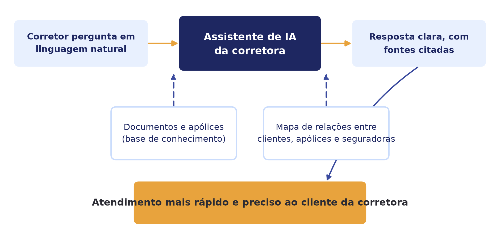{width=90%}

## Começando simples: consulta a documentos

- O assistente é treinado para consultar manuais, apólices e contratos das seguradoras parceiras
- Quando o corretor faz uma pergunta, ele busca a informação nos documentos certos
- A resposta sempre indica de onde veio a informação, para gerar confiança
- Essa é a base: uma forma de a IA responder com apoio em fontes confiáveis, e não apenas "adivinhar"

## Evoluindo: entendendo as conexões entre as informações

- Com o tempo, a NovaSeguro passa a mapear como as informações se relacionam: clientes, apólices, coberturas, sinistros e seguradoras
- Isso permite responder perguntas mais ricas, como identificar sobreposições de cobertura entre seguradoras diferentes
- O assistente passa a enxergar o panorama completo do cliente, e não apenas um documento isolado
- É um salto de "responder perguntas" para "gerar recomendações de negócio"

## Indo além: prevendo receita e risco de cancelamento

- O mesmo assistente passa a olhar para o histórico de uso e de relacionamento de cada cliente
- Com base nesses sinais, ele estima a chance de cada apólice ser renovada ou cancelada
- Essa estimativa alimenta uma projeção da receita futura da corretora, mês a mês
- Uma decisão antes baseada só em intuição passa a ser apoiada em dados

## Antecipando a renovação, antes do cliente decidir

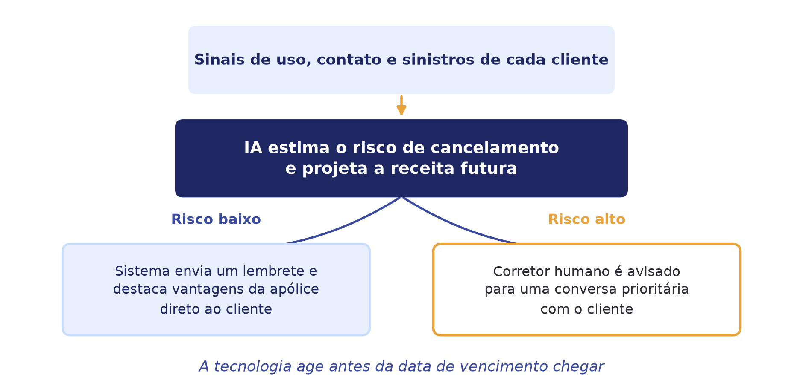{width=88%}

::: notes
Quando o risco de cancelamento é baixo, o próprio sistema entra em contato
com o cliente, lembrando do valor da apólice antes do vencimento. Quando o
risco é alto ou o caso é mais sensível, a prioridade passa para um corretor
humano, que consegue agir a tempo em vez de descobrir a perda só na hora da
renovação.
:::

## Do papel para a tela: a ferramenta em produção

{width=85%}

::: notes
Tudo que foi descrito até aqui não ficou só no conceito: esta é a página
inicial real da ferramenta, já construída, com a mesma identidade visual
usada nesta apresentação. A partir daqui, alguns prints do dia a dia de
quem usa o copiloto.
:::

## Painel do corretor, com dados reais da carteira

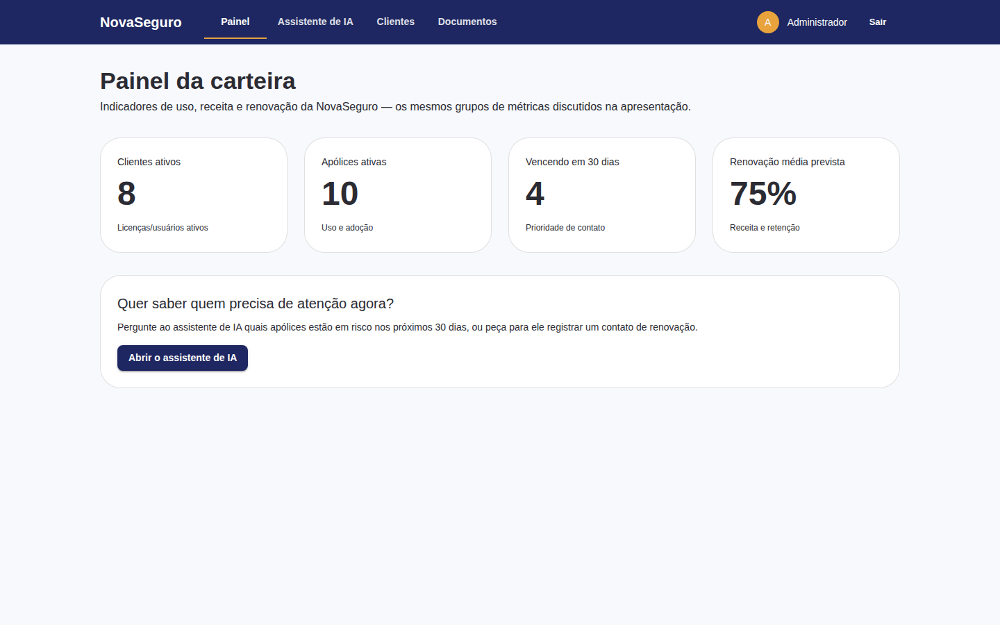{width=85%}

## Conversando com o copiloto de IA

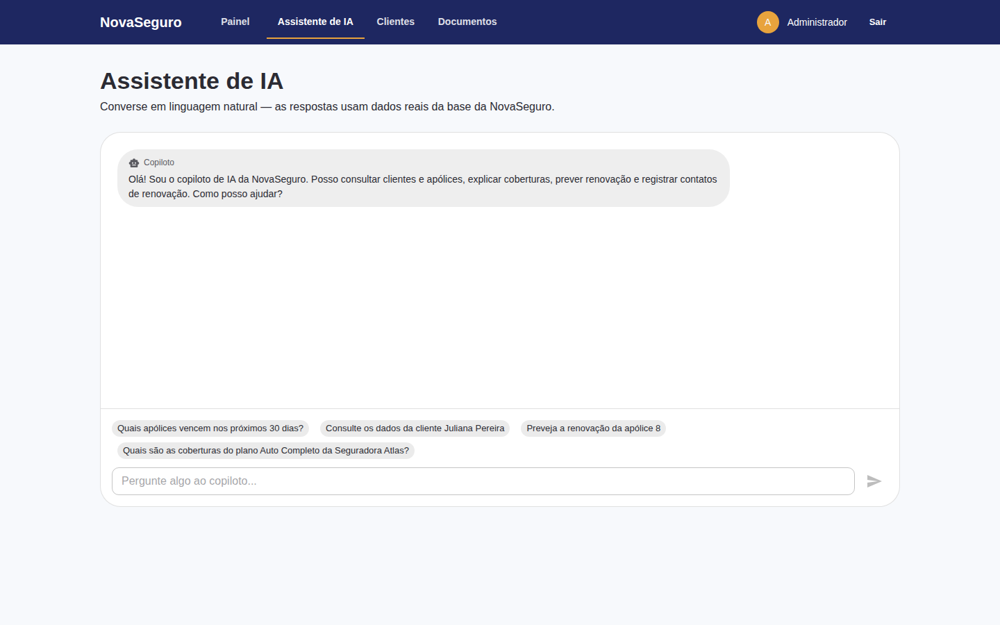{width=85%}

## Visão da carteira de clientes

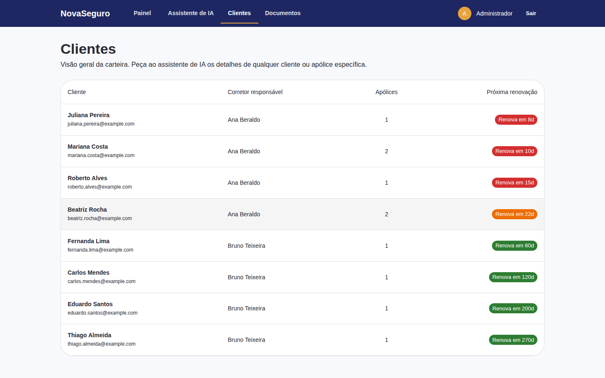{width=85%}

## Enviando apólices em PDF para a base de conhecimento

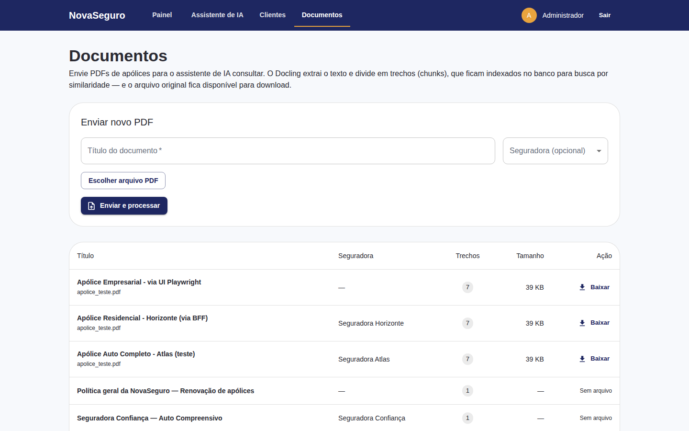{width=85%}

## Benefícios para o negócio

- Atendimento mais rápido e preciso, com menos tempo de espera para o cliente
- Menos cancelamentos, porque sinais de risco são tratados antes do vencimento da apólice
- Previsão de receita mais confiável, o que ajuda o planejamento financeiro da corretora
- Decisões melhores, apoiadas em uma visão mais completa de cada cliente

## Cuidados importantes

- A qualidade da previsão depende da qualidade dos dados usados como fonte
- Pessoas continuam responsáveis por revisar decisões de maior impacto
- O contato automático com o cliente precisa ser cuidadoso, sem parecer invasivo ou impessoal
- Inteligência artificial é uma ferramenta poderosa, mas não substitui a governança do negócio

# Obrigado
